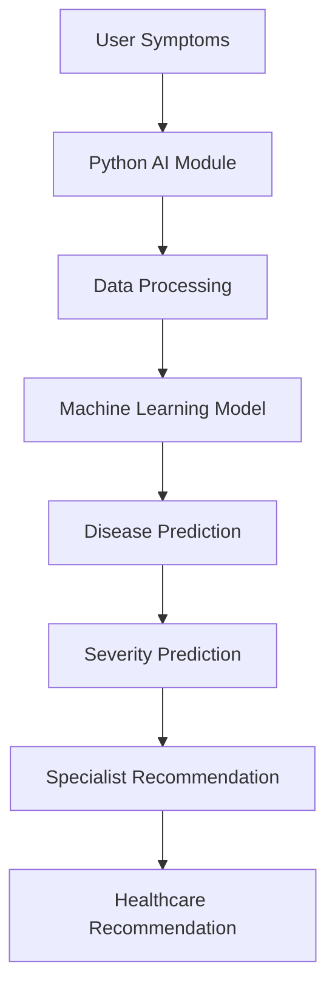

#  **Geographical Mapping for Hospitals, Clinics & Mobile Medical Units**

<p align="center">

# Smart Healthcare Mapping Platform

### Connecting People with Healthcare Through Maps, AI & Telemedicine


</p>

---

#  Overview

Geographical Mapping for Hospitals, Clinics & Mobile Medical Units is a smart healthcare platform that combines interactive GIS mapping, healthcare facility discovery, AI-assisted healthcare recommendations, telemedicine support, emergency information and Progressive Web App (PWA) capabilities into a single application.

The repository contains the React frontend together with supporting services including an AI recommendation module, realtime communication server, signaling server, trained machine learning models, healthcare datasets and deployment configuration.

> **Note:** This repository represents a prototype/MVP demonstrating a modern smart healthcare mapping ecosystem.

---

# Preview


---

# Features

## Interactive Healthcare Mapping

- Interactive map interface
- Healthcare facility visualization
- Nearby healthcare discovery
- User location support
- Responsive mapping interface

## AI Healthcare Recommendation Module

- Disease prediction
- Severity prediction
- Specialist recommendation
- Healthcare recommendation engine
- Trained Machine Learning models
- Healthcare datasets
- Python recommendation backend

## Authentication

- Login
- Signup
- Forgot Password
- Guest Mode

## Healthcare Services

- Live Map
- Nearby Healthcare Facilities
- Telemedicine
- Emergency Information

## Progressive Web App

- Offline support
- Service Worker
- Manifest
- Offline page

## Supporting Services

- Realtime Server
- Signaling Server
- Docker support
- Railway deployment configuration

---

# Tech Stack

### Frontend

- React
- Vite
- JavaScript
- HTML5
- CSS

### Backend / AI

- Python
- Machine Learning
- Pickle Models

### Data

- Healthcare datasets
- Trained ML models

### Deployment

- Docker Compose
- Railway

---

# Architecture


---

#  AI Workflow



---

#  Project Structure

```text
Geographical-mapping/

├── src/
├── public/
├── app/
├── data/
├── models/
├── notebooks/
├── realtime-server/
├── signaling/
├── tests/
├── main.py
├── requirements.txt
├── package.json
├── docker-compose.yml
├── railway.json
├── .env.example
└── README.md
```

---

# ⚙️ Local Setup

## Prerequisites

- Node.js
- npm
- Python 3.10+
- Git (optional)

---

## Clone Repository

```bash
git clone https://github.com/Rashi1575/Geographical-mapping.git

cd Geographical-mapping
```

---

## Install Frontend

```bash
npm install
```

Run

```bash
npm run dev
```

Open

```
http://localhost:5173
```

---

## Configure Python

Create virtual environment

```bash
python -m venv venv
```

Windows

```bash
venv\Scripts\activate
```

Install requirements

```bash
pip install -r requirements.txt
```

Run

```bash
python main.py
```

or

```bash
python app/main.py
```

---

## Environment Variables

Copy

```
.env.example
```

to

```
.env
```

Configure values as required.

---

## Other Services

Realtime Server

```bash
cd realtime-server

npm install

npm start
```

Signaling Server

```bash
cd signaling

npm install

npm start
```

---

#  Components Included

- React Frontend
- Authentication
- Guest Mode
- Live Map
- Nearby Healthcare Facilities
- Telemedicine
- Emergency Information
- AI Recommendation Module
- Machine Learning Models
- Healthcare Datasets
- Realtime Server
- Progressive Web App Support

---

#  Future Improvements

- Live appointment booking
- Advanced routing
- Enhanced AI models

---

---

#  Author

**Rashi Singh**


#  License

This project was developed for educational, research, and internship purposes.

Use responsibly and do not treat predictions as medical diagnoses.

Always consult licensed healthcare professionals for medical decisions.
